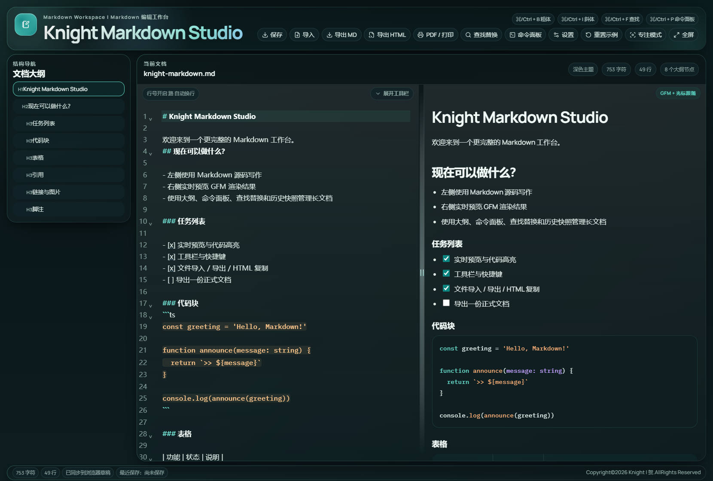
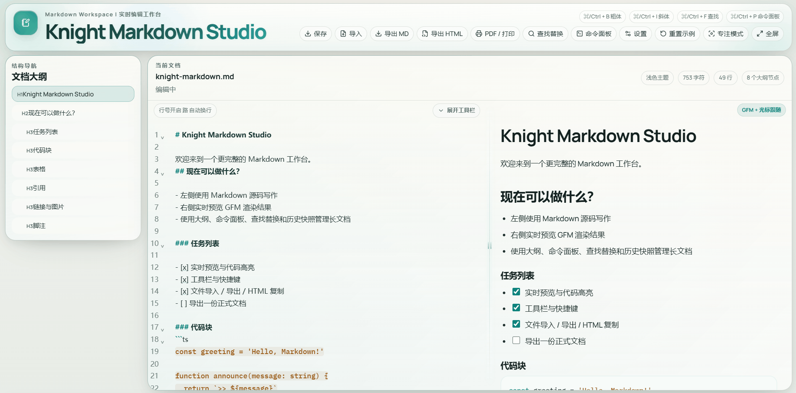

<div align="center">
  
</div>

<div align="center">
  
</div>

<p align="center">
  一个完整的 Markdown 工作台：左侧专注源码写作，右侧即时预览排版结果，同时提供大纲导航、历史快照、导出能力、主题切换等能力。
</p>

<p align="center">
  
  
  
  
  
</p>

## 项目简介

Knight Markdown Studio 是一个面向持续写作、技术文档整理和 Markdown 交付的单页面工作台。
它把源码编辑、实时预览、结构导航、历史快照、主题切换和导出交付放进了同一个界面里，让 Markdown 不只是“能写”，而是更适合长期编辑使用。

适合这些场景：

- 技术文档、API 说明与产品方案
- 学习笔记、知识库草稿与博客写作
- 需要一边写源码、一边看排版结果的 Markdown 工作流

## 最近更新

- 实时滚动跟踪预览：左侧源码区滚动时，右侧预览会实时跟到对应内容块
- 光标 / 点击 / 大纲联动：左侧点击、光标定位和大纲跳转都会驱动右侧预览定位
- 独立双栏滚动：右侧预览实时跟随左侧，长文档编辑更稳定
- 导出 HTML 升级：导出的独立 HTML 现在自带大纲视图、章节跳转和更完整的阅读样式

## 界面预览

### 工作台总览

首页采用品牌化头部、左侧结构导航、中间源码编辑、右侧渲染预览的工作台布局，适合长文档持续写作与交付。


### 主题切换

应用支持 `light`、`dark` 和 `system` 三种主题模式，并会记住用户偏好。浅色更适合整理与阅读，深色更适合连续写作与技术内容浏览。

| 浅色主题 | 深色主题 |
| --- | --- |
|  |  |

### 实时滚动跟踪预览

左侧源码区滚动时，右侧预览会持续跟到对应区块。编辑、浏览和定位不再割裂，尤其适合学习笔记、技术文档、方案和知识库类长文档。



### 代码块高亮

代码块高亮不仅是“把代码染色”，更重要的是让技术内容在预览区里保持清晰、稳定、可读：

- 支持 fenced code block 与 inline code 的差异化展示
- 代码高亮风格会与当前主题保持一致
- 适合技术文档、接口说明、学习笔记和工程博客写作



## 核心能力

| 模块 | 能力 |
| --- | --- |
| 编辑 | Markdown 工具栏、快捷键、自动换行、行号开关、查找替换 |
| 导航 | 文档大纲、标题跳转、左侧滚动 / 光标 / 点击驱动右侧预览跟踪 |
| 持久化 | 自动保存、草稿恢复、历史快照、重置示例 |
| 导出 | Markdown、独立 HTML、复制 HTML、PDF / 打印 |
| 个性化 | `light` / `dark` / `system`、字号、预览宽度、代码字体 |
| 媒体 | `.md` 导入、图片 URL、图片文件粘贴与拖拽插入 |
| 体验 | 移动端编辑 / 预览 / 分屏三态、命令面板、专注模式、全屏 |

## 技术栈

- React 19
- TypeScript
- Vite
- CodeMirror 6
- markdown-it
- highlight.js
- DOMPurify
- Vitest + Testing Library

## 本地开发

### 安装依赖

```bash
npm install
```

### 启动开发环境

```bash
npm run dev
```

Vite 会在本地可用端口启动，常见地址是：

```text
http://localhost:5173/
```

### 构建生产版本

```bash
npm run build
```

### 本地预览生产包

```bash
npm run preview
```

## 可用脚本

```bash
npm run dev
npm run build
npm run preview
npm run lint
npm run test
```

## 目录结构

```text
src/
  components/    UI 组件
  hooks/         编辑器、预览、设置与交互 hooks
  lib/           Markdown 渲染、存储、导出、同步与编辑逻辑
  test/          测试辅助与测试配置
  types/         类型定义

public/          静态资源
```

## 质量保障

当前项目已覆盖这些基础检查：

- `npm run lint`
- `npm run test`
- `npm run build`

## License

本项目基于 [MIT License](./LICENSE) 开源。 | 随便用哈哈哈

## 关于作者

Knight | 贺 |  持续探索vibe-condig
