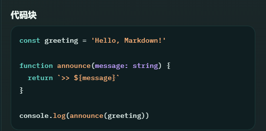

<div align="center">
  
</div>

<div align="center">
  
</div>

<p align="center">
  一个完整的 Markdown 工作台：左侧专注源码写作，右侧即时预览排版结果，同时提供大纲导航、历史快照、导出能力、主题切换等能力。
</p>

<p align="center">
  
  
  
  
  
</p>

## 项目简介

Knight Markdown Studio 是一个面向长期写作与技术内容整理的单页面 Markdown 编辑器。

它把源码编辑、实时预览、结构导航、草稿恢复、主题切换和导出交付收拢到同一个工作台里，让 Markdown 不只是“能写”，而是更适合持续写作、知识沉淀和技术表达。

适合这些场景：

- 技术文档与接口说明
- 学习笔记与知识库草稿
- 博客初稿与长文写作
- 需要一边写源码、一边看排版结果的 Markdown 工作流

## 核心亮点

- 双栏工作台：左侧源码编辑，右侧即时预览，桌面端与移动端都有合适布局。
- 实时预览：基于 GFM 渲染，支持表格、任务列表、图片、引用、脚注和代码块高亮。
- 长文档友好：支持大纲导航、块级滚动同步、查找替换、历史快照与自动保存。
- 导出完整：支持导入 `.md`、导出 Markdown、复制 HTML、导出独立 HTML，以及 PDF / 打印。
- 产品化体验：支持 `light`、`dark`、`system` 主题，提供字体、预览宽度、代码字体等个性化设置。

## 界面预览

### 工作台总览

应用采用产品化的双栏工作区布局，品牌头部、结构导航、编辑区与预览区在一个界面中协同工作，适合持续写作与技术内容管理。


### 主题切换

应用支持 `light`、`dark` 和 `system` 三种主题模式，并会记住用户偏好。浅色主题更适合阅读与整理，深色主题更适合专注写作与技术内容浏览。

| 浅色主题 | 深色主题 |
| --- | --- |
|  |  |

### 代码块高亮

<div align="center">
  
</div>

代码块高亮不仅是“把代码染色”，更重要的是让技术内容在预览区里保持清晰、稳定、可读：

- 支持 fenced code block 与 inline code 的差异化展示
- 代码块高亮风格会与当前主题保持一致
- 更适合技术文档、接口说明、学习笔记和工程博客写作



## 功能概览

| 模块 | 能力 |
| --- | --- |
| 编辑 | Markdown 工具栏、快捷键、自动换行、行号开关、查找替换 |
| 导航 | 文档大纲、标题跳转、编辑区与预览区块级同步 |
| 持久化 | 自动保存、草稿恢复、历史快照、重置示例 |
| 导出 | Markdown、独立 HTML、复制 HTML、PDF / 打印 |
| 个性化 | `light` / `dark` / `system`、字体大小、预览宽度、代码字体 |
| 媒体 | `.md` 拖拽导入、图片 URL、图片文件粘贴与预览 |

## 技术栈

- React 19
- TypeScript
- Vite
- CodeMirror 6
- markdown-it
- highlight.js
- DOMPurify
- Vitest + Testing Library

## 本地开发

### 安装依赖

```bash
npm install
```

### 启动开发环境

```bash
npm run dev
```

默认本地地址通常为：

```text
http://localhost:5173/
```

### 构建生产版本

```bash
npm run build
```

### 本地预览生产包

```bash
npm run preview
```

## 可用脚本

```bash
npm run dev
npm run build
npm run preview
npm run lint
npm run test
```

## 目录结构

```text
src/
  components/    UI 组件
  hooks/         编辑器、预览、设置与交互 hooks
  lib/           Markdown 渲染、存储、导出、同步与编辑逻辑
  test/          测试辅助与测试配置
  types/         类型定义

public/          静态资源
```

## 质量保障

当前项目已经覆盖这些基础检查：

- `npm run lint`
- `npm run test`
- `npm run build`

## License

本项目基于 [MIT License](./LICENSE) 开源。
