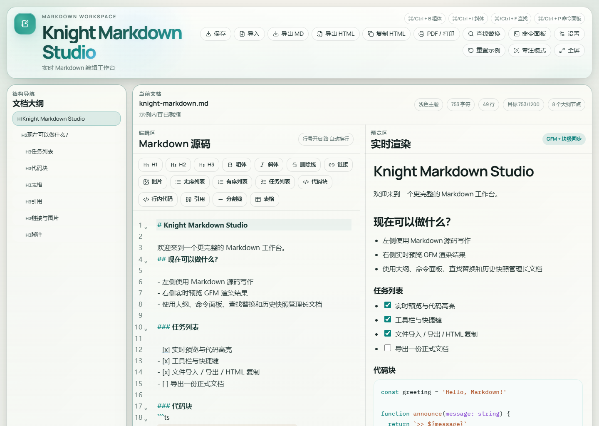
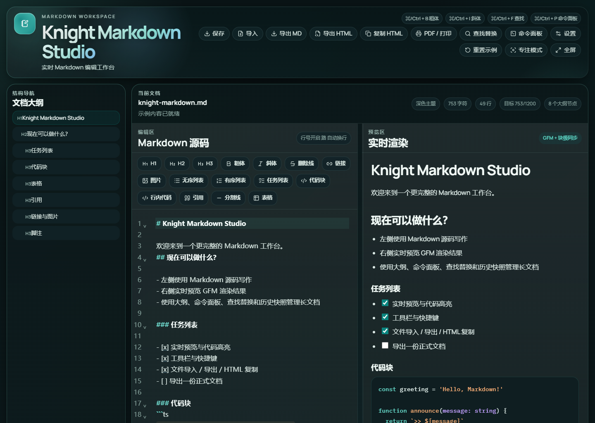
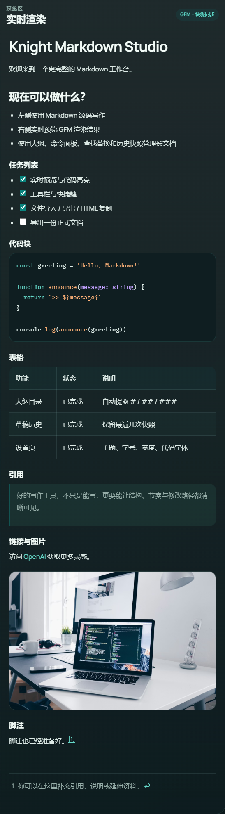

<div align="center">
  
</div>

<div align="center">
  
</div>

<p align="center">
  一个完整的 Markdown 工作台：左侧专注源码写作，右侧即时预览排版结果，
  同时提供大纲导航、历史快照、导出能力、主题切换等能力。
</p>

<p align="center">
  
  
  
  
  
</p>

## 项目简介

Knight Markdown Studio 是一个单页面 Markdown 编辑器，但目标不只是“能写 Markdown”。

它更像一个写作工作台，把这些能力放到同一个界面里：

- 左侧源码编辑，右侧实时渲染
- 文档结构与大纲跳转
- 草稿自动保存与历史快照恢复
- HTML / PDF / Markdown 导出
- 浅色、深色与跟随系统主题

它适合：

- 技术文档
- 知识笔记
- 长文写作
- 开发者内容
- 需要边写边看排版结果的 Markdown 工作流

## 界面预览

### 产品总览

主界面采用双栏工作区布局，保留产品感的品牌头部、结构导航和实时预览区域，适合长期编辑与内容管理。



### 主题切换

应用支持 `light`、`dark` 和 `system` 三种主题模式，并会记住用户偏好。浅色模式更适合日常阅读与整理，深色模式更适合夜间写作与技术内容浏览。

| 浅色主题 | 深色主题 |
| --- | --- |
|  |  |

### 代码块高亮

<div align="center">
  
</div>

代码块高亮能力不只是“把代码染色”，它更偏向技术写作场景的可读性表达：

- 支持代码块语法高亮
- 支持行内代码与代码块区分展示
- 预览区高亮风格会与整体主题协调变化
- 更适合开发文档、接口说明、技术博客和学习笔记



## 核心能力

### 1. 实时 Markdown 编辑

- 左侧基于 CodeMirror 6 的源码编辑区
- 右侧即时渲染的 GFM 预览
- 支持标题、粗体、斜体、删除线、列表、任务列表、表格、链接、图片、引用、脚注
- 输入后快速更新预览，保持写作连续性

### 2. 主题切换与产品化界面

- 浅色主题
- 深色主题
- 跟随系统主题
- 可调字体大小
- 可调预览宽度
- 可切换代码字体

### 3. 代码块高亮与技术写作体验

- 支持代码块语法高亮
- 支持行内代码
- 预览层更适合展示技术内容
- 深色模式下针对标题、链接、Markdown 标记做了可读性优化

### 4. 面向长文档的结构能力

- 自动提取 `# / ## / ###` 生成文档大纲
- 点击大纲可跳转到对应位置
- 编辑区与预览区支持块级滚动同步
- 支持查找替换
- 支持命令面板

### 5. 草稿安全与恢复

- 自动保存到本地
- 刷新后恢复上次草稿
- 保留最近历史快照
- 支持快速重置与历史恢复

### 6. 导入、导出与交付

- 导入 `.md`
- 导出 Markdown
- 导出独立 HTML
- 复制 HTML
- PDF / 打印

## 功能概览

| 模块 | 能力 |
| --- | --- |
| 编辑 | Markdown 工具栏、快捷键、自动换行、行号开关、查找替换 |
| 导航 | 大纲面板、标题跳转、块级同步 |
| 展示 | 浅色/深色主题、预览宽度、产品化预览样式 |
| 媒体 | 拖拽图片、粘贴图片 URL、粘贴图片文件 |
| 导出 | Markdown、HTML、复制 HTML、PDF/打印 |
| 恢复 | 自动保存、草稿恢复、历史快照 |

## 技术栈

- React 19
- TypeScript
- Vite
- CodeMirror 6
- markdown-it
- highlight.js
- DOMPurify
- Vitest + Testing Library

## 本地开发

### 安装依赖

```bash
npm install
```

### 启动开发环境

```bash
npm run dev
```

常见本地地址：

```text
http://localhost:5173/
```

### 构建生产版本

```bash
npm run build
```

### 本地预览生产包

```bash
npm run preview
```

## 可用脚本

```bash
npm run dev
npm run build
npm run preview
npm run lint
npm run test
```

## 目录结构

```text
src/
  components/    UI 组件
  hooks/         编辑器、预览、全屏、偏好设置等 hooks
  lib/           Markdown 渲染、存储、导出、同步与编辑逻辑
  types/         类型定义

docs/assets/     README 展示截图
```

## 为什么做这个项目

很多 Markdown 编辑器只解决一件事：输入。

但真实写作通常同时需要四件事：

1. 写内容
2. 看结构
3. 预览排版
4. 防止丢稿

Knight Markdown Studio 想把这四件事收进同一个干净、现代、可持续扩展的工作台里。

## 质量保障

当前项目已经覆盖这些基础检查：

- `npm run lint`
- `npm run test`
- `npm run build`

## Roadmap

- 更完整的 Markdown 资源导出策略
- 更细的生产包体积优化
- 可选的在线部署路径
- 更丰富的模板与内容工作流

## License

本项目基于 [MIT License](./LICENSE) 开源。
